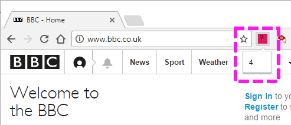
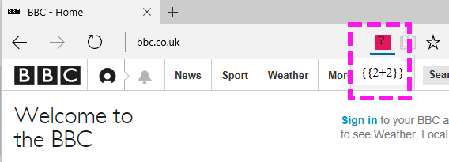

# Angular expression evaluates in Chrome extension but not in Edge extension

I have a simple browser extension, using Angular (v1.6.3), but the Angular expression in the pop-up window of the extension is failing to evaluate in Edge, but it is in Chrome.

The Angular expression is simply ```<div>{{2+2}}</div>```.


When I browse to a website that the extension is configured for in it's [manifest file](https://github.com/GregTrevellick/BrowserExtensionUsingAngularWorksInChromeNotInEdge/blob/master/app/manifest.json), namely http://marketplace.visualstudio.com, https://marketplace.visualstudio.com or http://www.bbc.com and click the extension button, Chrome evaluates the html output to "4", but Edge evaluates the html output to "{{2+2}}".    

Chrome as a browser extension



Edge as a browser extension



I believe the html and angular interaction itself is fundamentally sound, because when I browse directly to the [pop up page](https://github.com/GregTrevellick/BrowserExtensionUsingAngularWorksInChromeNotInEdge/blob/master/app/popup.html), using a URL such as ```file:///C:/temp/app/popup.html```, both Chrome and Edge evaluate the expression ```{{2+2}}``` to "4". 

Chrome direct browse to [popup.html](https://github.com/GregTrevellick/BrowserExtensionUsingAngularWorksInChromeNotInEdge/blob/master/app/popup.html)


Edge direct browse to [popup.html](https://github.com/GregTrevellick/BrowserExtensionUsingAngularWorksInChromeNotInEdge/blob/master/app/popup.html)


To summarize it is only as an Edge extension that the evaluation fails, as a Chrome extension or as a non-extension in Edge and Chrome it works.

I have a video demo of the issue on [You tube](https://youtu.be/IRI3na7BQMM)

I have placed a full version of the source code on [GitHub](https://github.com/GregTrevellick/BrowserExtensionUsingAngularWorksInChromeNotInEdge) but extension is quite simple, as follows:

A [popup.html](https://github.com/GregTrevellick/BrowserExtensionUsingAngularWorksInChromeNotInEdge/blob/master/app/popup.html) file page for the pop-up window, which contains the Angular expression:

```
<html>
<head>
    <script type="text/javascript" src="scripts/angular.min.js"></script>
    <script type="text/javascript" src="scripts/app.js"></script>
</head>
<body>
    <div ng-app="myApp">
        <div>{{2+2}}</div>
    </div>
</body>
</html>
```

A [app.js](https://github.com/GregTrevellick/BrowserExtensionUsingAngularWorksInChromeNotInEdge/blob/master/app/scripts/app.js) file to define the angular module:

```var myApp = angular.module('myApp', []);```

A [contentscript.js](https://github.com/GregTrevellick/BrowserExtensionUsingAngularWorksInChromeNotInEdge/blob/master/app/scripts/contentscript.js) that tells the website to open the pop-up: 
``` 
window.browser = (function () {
    return window.msBrowser ||
      window.browser ||
      window.chrome;
})();

window.browser.runtime.sendMessage({ action: "openPopUp" });
```

A [background.js](https://github.com/GregTrevellick/BrowserExtensionUsingAngularWorksInChromeNotInEdge/blob/master/app/scripts/background.js) script that actually opens the popup.html file:

```window.browser = (function () {
    return window.msBrowser ||
      window.browser ||
      window.chrome;
})();

window.browser.runtime.onMessage.addListener(
    function (request, sender, sendResponse) {
        if (request.action == "openPopUp") {
            window.browser.tabs.query({ active: true, currentWindow: true },
                function (tabs) {
                    window.browser.pageAction.show(tabs[0].id);
                });
        }
    });
    ```

And finally a [manifest.json](https://github.com/GregTrevellick/BrowserExtensionUsingAngularWorksInChromeNotInEdge/blob/master/app/manifest.json) file that wires everything up together, which both browsers understand:

```{
  "manifest_version": 2,
  "name": "BrowserExtensionUsingAngularWorksChromeNotEdge",
  "version": "1.0.0",
  "author": "Greg Trevellick",
  "page_action": {
    "default_icon": {
      "19": "icon_19x19.png"
    },
     "default_popup": "popup.html"
    },
  "background": {
    "scripts": [ "scripts/background.js" ],
    "persistent": false
  },
  "content_scripts": [
    {
      "matches": [
        "http://marketplace.visualstudio.com/*",
        "https://marketplace.visualstudio.com/*",
        "http://www.bbc.co.uk/*"
      ],
      "js": [
        "scripts/contentscript.js",
        "scripts/angular.min.js"
      ]
    }
  ],
  "permissions": [
    "activeTab",
    "declarativeContent",
    "http://marketplace.visualstudio.com/",
    "https://marketplace.visualstudio.com/",
    "http://www.bbc.co.uk/"
  ],
  "content_security_policy": "script-src 'self' 'unsafe-eval'; object-src 'self'"
}
```

For what its worth, some instructions on getting started with Chrome extensions can be found [here](https://developer.chrome.com/extensions/getstarted) and for Edge [here](https://channel9.msdn.com/Blogs/One-Dev-Minute/Debugging-Microsoft-Edge-Extensions).


TAGS

google-chrome 
google-chrome-extension
microsoft-edge
microsoft-edge-extension
angular
